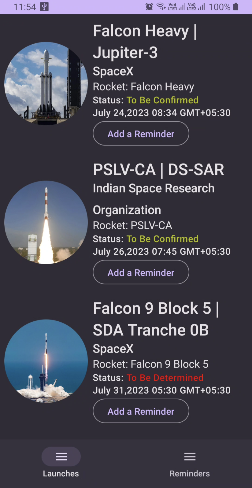
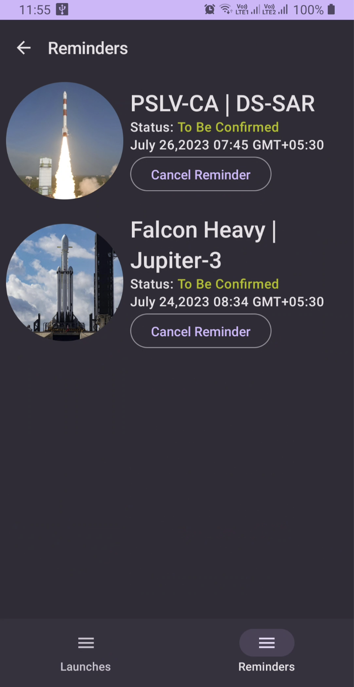

#  Space Dawn

**Space Dawn** is a demo app built to demonstrate the use of **Mutli-Module Clean MVVM Architecture** with **Jetpack Compose** by following Material-3 guidelines along with other MAD libraries

|  Architecture   | Multi-Module Clean MVVM Architecture |
|----------------	|------------------------------	|
|     UI Framework  | [Jetpack Compose](https://www.jetbrains.com/lp/compose-multiplatform/)         |                        |
| 💉 DI                | [Dagger-Hilt](https://developer.android.com/training/dependency-injection/hilt-android)                        |             |
| 🌐 Networking        | [Retrofit](https://github.com/square/retrofit) + [Moshi](https://github.com/square/moshi)                   |
| :floppy_disk: Local Datbase      | [Room Database](https://developer.android.com/topic/libraries/architecture/room)                   |
| :compass: Navigation       |  [Compose Destinations Navigation](https://developer.android.com/jetpack/compose/navigation) |
| :building_construction: Persistent Background Work  | [WorkManager](https://developer.android.com/topic/libraries/architecture/workmanager) + [AlarmManager](https://developer.android.com/reference/android/app/AlarmManager) |
| :thread: Asynchronous Work     |  [Coroutines](https://kotlinlang.org/docs/reference/coroutines-overview.html)|
| 🖼️ Image Loading     |  [Coil](https://coil-kt.github.io/coil/)|

  <video src="https://github.com/avidraghav/SpaceDawn/assets/49483235/4e320b7d-d66d-4e42-8c94-705057fb8939" width="400" />

## 🛠 Built With

- [Kotlin](https://kotlinlang.org/) - First class and official programming language for Android
  development from Jetbrains.
- [Jetpack Compose](https://developer.android.com/jetpack/compose) - Jetpack Compose is Android’s
  modern toolkit for building native UI.
- [Coroutines](https://kotlinlang.org/docs/reference/coroutines-overview.html) - A coroutine is a
  concurrency design pattern that you can use on Android to simplify code that executes
  asynchronously.
- [Flow](https://kotlinlang.org/docs/reference/coroutines/flow.html) - A flow is an asynchronous
  version of a Sequence, a type of collection whose values are lazily produced.
- [Android Architecture Components](https://developer.android.com/topic/libraries/architecture) -
  Collection of libraries that help you design robust, testable, and maintainable apps.
    - [Stateflow](https://developer.android.com/kotlin/flow/stateflow-and-sharedflow) - StateFlow is
      a state-holder observable flow that emits the current and new state updates to its collectors.
    - [Dagger-Hilt](https://developer.android.com/training/dependency-injection/hilt-android) - Dagger-Hilt is an official dependency injection library for Android, simplifying the process of managing dependencies and providing compile-time safety.
    - [Flow](https://kotlinlang.org/docs/reference/coroutines/flow.html) - A flow is an asynchronous
      version of a Sequence, a type of collection whose values are lazily produced.
    - [ViewModel](https://developer.android.com/topic/libraries/architecture/viewmodel) - Stores
      UI-related data that isn"t destroyed on UI changes.
    - [Compose Destinations Navigation](https://developer.android.com/jetpack/compose/navigation) - 
      Simplified and type-safe navigation for Compose.
    - [WorkManager](https://developer.android.com/topic/libraries/architecture/workmanager) - 
      Schedule automatically repeating or guarantee one-time background processing.
    - [Room Database](https://developer.android.com/topic/libraries/architecture/room) -
      Abstraction layer over SQLite, simplifying local data storage and access in Android apps..
- [AlarmManager](https://developer.android.com/reference/android/app/AlarmManager)
    - AlarmManager API allows scheduling and managing alarms to perform actions at specified times or intervals, even if the app is not running.
- [Retrofit](https://github.com/square/retrofit) - A type-safe HTTP client for Android and the JVM
- [Moshi](https://github.com/square/moshi) - A modern JSON library for Kotlin and Java.
- [Material Components for Android](https://github.com/material-components/material-components-android)
    - Modular and customizable Material Design UI components for Android.
- [Coil](https://coil-kt.github.io/coil/)
    - Image loading library for Compose.
 

## :iphone: Screenshots
<table style="width:100%">
  <tr>
    <th>Upcoming Launches Screen</th>
    <th>Reminders Screen Screen</th> 
    <th>Notification Sample</th> 
  </tr>
  <tr>
    <td></td> 
    <td></td>
    <td></td>

  </tr>
</table>

## 🏗️ Architecture Diagram

Useful links
1. https://plugins.gradle.org/plugin/org.jlleitschuh.gradle.ktlint
2. https://sdkman.io/usage
3. https://www.kodeco.com/10562143-continuous-integration-for-android
