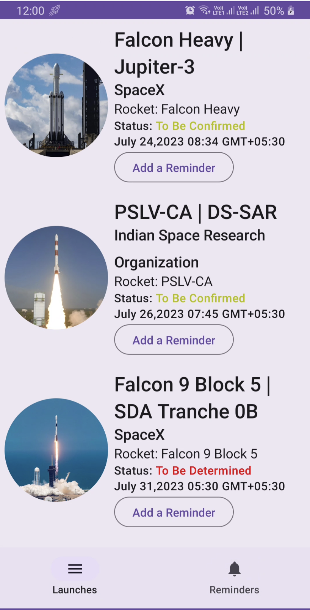
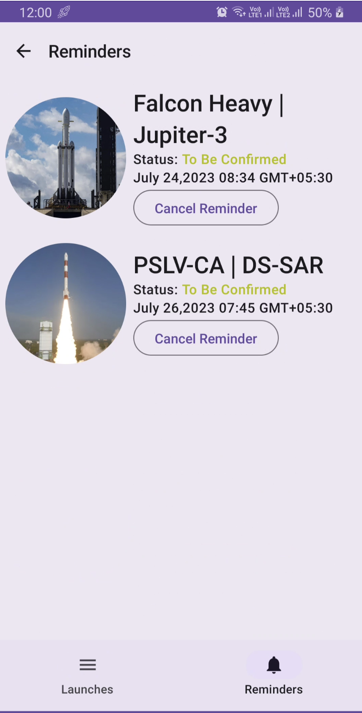
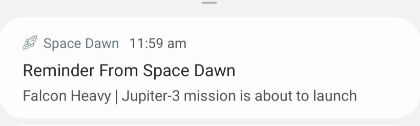

<div align="center">
  <image height= "100" width ="100" src="https://github.com/avidraghav/SpaceDawn/assets/49483235/d6ee6d64-4eda-40b2-b49f-3ff2b8e9772e" /></image><br>
  <strong>Space Dawn</strong>
</div>
<br>

[](https://github.com/avidraghav/spacedawn/actions)
[](LICENSE)
[](https://mailchi.mp/kotlinweekly/kotlin-weekly-364)
<br>
[](https://ktlint.github.io/)
[](https://github.com/avidraghav/spacedawn/issues)
<br>

**Space Dawn** is a demo app built to demonstrate the use of **Mutli-Module Clean MVVM Architecture** with **Jetpack Compose** by following **Material-3** guidelines along with other MAD libraries. 
The app lets a user **Save reminders/alarms for the upcoming Rocket Launches From around the world**.
<br>

**Click on the link below to get the latest version Space Dawn 🚀**

[](https://github.com/avidraghav/spacedawn/releases/latest/download/app-release.apk)

## 🛠 Built With
|  Architecture   | Multi-Module Clean MVVM Architecture |
|----------------	|------------------------------	|
|     UI Framework  | [Jetpack Compose](https://www.jetbrains.com/lp/compose-multiplatform/)         |                        |
| 💉 DI                | [Dagger-Hilt](https://developer.android.com/training/dependency-injection/hilt-android)                        |             |
| 🌐 Networking        | [Retrofit](https://github.com/square/retrofit) + [Moshi](https://github.com/square/moshi)                   |
| :floppy_disk: Local Database      | [Room Database](https://developer.android.com/topic/libraries/architecture/room)                   |
| :compass: Navigation       |  [Compose Destinations Navigation](https://developer.android.com/jetpack/compose/navigation) |
| :building_construction: Persistent Background Work  | [WorkManager](https://developer.android.com/topic/libraries/architecture/workmanager) + [AlarmManager](https://developer.android.com/reference/android/app/AlarmManager) |
| :thread: Asynchronous Work     |  [Coroutines](https://kotlinlang.org/docs/reference/coroutines-overview.html)|
| 🖼️ Image Loading     |  [Coil](https://coil-kt.github.io/coil/)|
<br>

## :movie_camera: Working Demo
<table style="width:100%">
  <tr>
    <th> <video src="https://github.com/avidraghav/SpaceDawn/assets/49483235/4e320b7d-d66d-4e42-8c94-705057fb8939" /></th>
       <th><p>The reminder in the demo fires right away and this is purposeful as to demonstrante the functionality.</p></th>
  </tr>
</table>
<br>

## :iphone: Screenshots (Dark and Light Theme)
<table style="width:100%">
  <tr>
    <th>Upcoming Launches Screen</th>
    <th>Reminders Screen</th> 
    <th>Notification Sample</th> 
  </tr>
  <tr>
    <td></td> 
    <td></td>
    <td></td>
  </tr>
    <tr>
    <th>Upcoming Launches Screen</th>
    <th>Reminders Screen</th> 
    <th>Notification Sample</th> 
  </tr>
  <tr>
    <td></td> 
    <td></td>
    <td></td>
  </tr>
</table>
<br>

## 🏗️ Architecture Diagram
<div align="center">

</div>
<br>

## ✔️ Tests 
Tests are continuosly being written. Check the `test` and `androidTest` source sets for already available test cases.

### 🚀  The app uses [Launch Library 2](https://thespacedevs.com/llapi) API for getting upcoming Rocket Launches.

## License

```
Copyright 2023 Raghav Aggarwal

Licensed under the Apache License, Version 2.0 (the "License");
you may not use this file except in compliance with the License.
You may obtain a copy of the License at

    http://www.apache.org/licenses/LICENSE-2.0

Unless required by applicable law or agreed to in writing, software
distributed under the License is distributed on an "AS IS" BASIS,
WITHOUT WARRANTIES OR CONDITIONS OF ANY KIND, either express or implied.
See the License for the specific language governing permissions and
limitations under the License.
```
